# hp3k_sim - HP3000 MPE/V Simulator Utility

- Version   : B.00.00
- Author    : Robert W.Mills
- Copyright : © Robert W.Mills [rwmills.uk@gmail.com], 2025-2026.
- Note      : This program comes with absolutely no warranty.
- License   : [GNU General Public License v3.0 or later](gnu.org/licenses/gpl-3.0.html)

## Description:

> **hp3k_sim** creates a Terminal Window in which to run an instance of the chosen HP3000 MPE/V Simulator. If the Simulator supports the 'Line Printer to PDF Convertor' then a 2nd Terminal Window is created where the Convertor displays its Status Messages.

> **hp3k_sim** uses a Windows INI format file to hold its configuration options. The contents of this file (hp3k_sim.config) **WILL** have a baring on how you install/run **hp3k_sim**. ***Please read it.***

> The look of the PDF emulates the iconic **Green Bar** continuous form paper that dominated the early computer age in several variants. The only feature missing is the sprockett holes.

> **hp3k_sim** was developed, tested and is in daily use, by the author, on Linux Mint Cinnamon Edition 21.3 'virginia'.

> ***Note:*** No attempt has been tried to run **hp3k_sim** with Windows (the author does not have access to it). It ***may*** work if you have installed the WSL (Windows Subsystem for Linux). If you try it then please let me know how it went.

### Supported Simulators

> **hp3k_sim** supports the following Simulators:

>> Gavin Scott's Big Series 58 Release 3.1 running MPE V/E G.40.00

>> David Bryan's Series 58 Release 15 running MPE V/E G.3P.00

>> David Bryan's Series III Release 15 running MPE V/R E.01.00

>> **Note:** No changes were made or are required for the above Simulators.

>> Plus any additional Series III or 58 Simulators that you setup yourself.

## Things to be aware of:

> If the Simulator sends its Line Printer output to a TCP Port then the Convertor Terminal Window will **automatically** close when you fully exit from the Simulator. This is after entering the command **bye** in response to the **sim>** prompt.

> If the Simulator sends its Line Printer output to a file then you will have to **manually** close the Convertor Terminal Window. This is done by making the Convertor Terminal Window active and then entering a **Ctrl+C** command.

## Reason for this release:

> Version B.00.00 is a Major Rewrite of A.00.00.

> It now uses Yad's Notebook Dialog, a new INI file processor, and additional error checking & reporting.

> The contents of the configuration (INI) file has also had a major reorganisation which makes it incompatible with the previous release.

> Version A.00.00 was only able to convert output sent to the Spooled Serial Printer on LDev #11 (Gavin Scott's Big Series 58) to 'Green Bar' PDF files. Version B.00.00 adds that functionality to Device Class LP (David Bryan's Series 58).

> Utility title changed because this is now for both MPE V/R and V/E Simulators.

## Screen Prints:

### The Simulator Select Screen

> 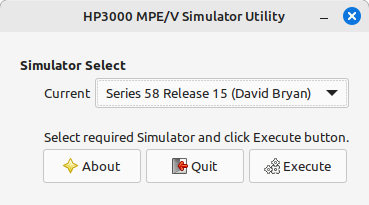 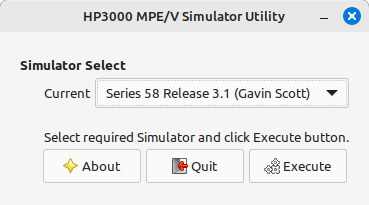

> The left-hand screen shows that David Bryan's Series 58 Simulator was chosen.

> The right-hand screen shows that Gavin Scott's Big Series 58 Simulator was chosen.

### The About Screen

> 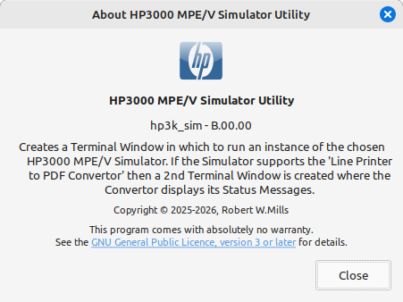

> This screen is displayed when the **About** button is clicked on the **Simulator Select** screen.

### The Simulator Configuration Tab

> 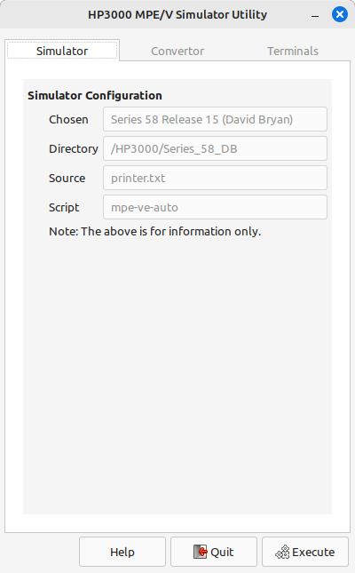 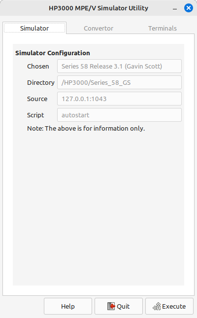

> The left-hand screen shows the configuration that would be used for David Bryan's Series 58 Simulator.

> The right-hand screen shows the configuration that would be used for Gavin Scott's Big Series 58 Simulator.

### The Convertor Configuration Tab

> 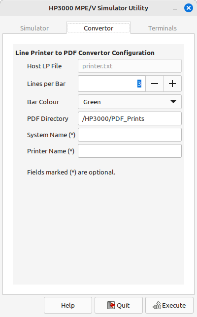 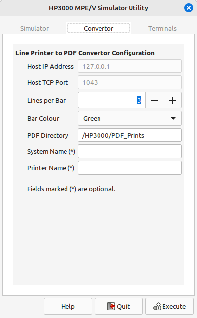

> The left-hand screen shows the default Convertor configuration that would be used for David Bryan's Series 58 Simulator.

> The right-hand screen shows the default Convertor configuration that would be used for Gavin Scott's Big Series 58 Simulator.

> 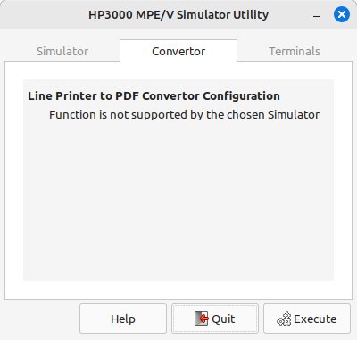

> This screen is displayed when the Convertor is ***not*** supported by the chosen Simulator.

### The Terminals Configuration Tab

> 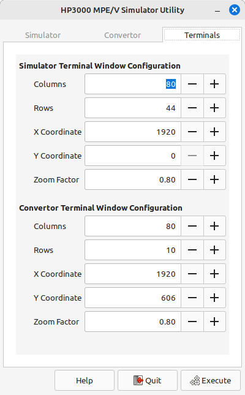 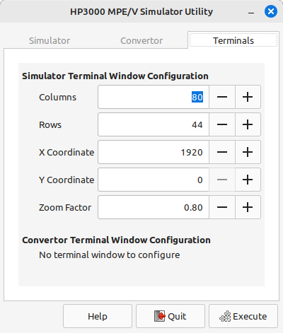

> The left-hand screen shows the default Terminal Window configurations that would be used if the Convertor is supported.

> The right-hand screen shows the default Terminal Window configuration that would be used if the Convertor is ***not*** supported.

### The Help Screen

> 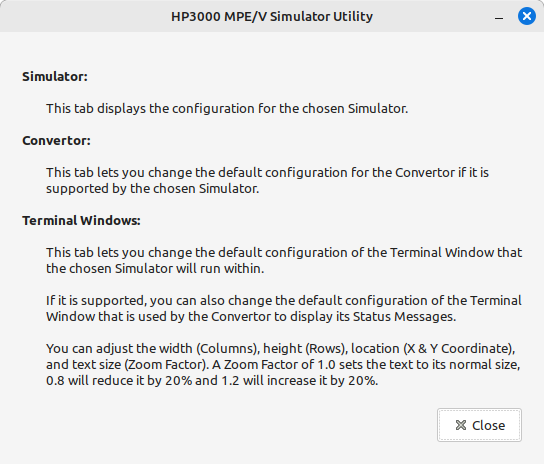

> This screen is displayed when the **Help** button is clicked on the screen containing the **Simulator**, **Convertor** and **Terminals** tabs's.

## Installing hp3k_sim:

### Assumptions

> **hp3k_sim** expects to be installed in sub-directories within the **$HOME/HP3000/** directory.

>> **Series_58_GS** -- [Gavin Scott's Big Series 58 Release 3.1](https://drive.google.com/uc?export=download&id=1AFlELXfs6DIm2RHpBlI-6qSe0VxYBWzz).

>> **Series_58_DB** -- [David Bryan's Series 58 Release 14](https://simh.trailing-edge.com/hp/#Downloads).

>> **Series_58** -- The authors version of the simulator, based on Gavin Scott's Release 3.1.

>> **PDF_Prints** -- Where the files created by the <u>Line Printer to PDF Convertor</u> are stored.

> **$HOME/bin/** -- This is where the executables are stored. It must be included in your **PATH** variable.

> **$HOME/bin/data/** -- This is where the data files required by the executables are stored.

> **$HOME/bin/doc/** -- This is an ***optional*** directory where the documentation can be stored.

### Required Software

> Each time **hp3k_sim** runs it will check that the following software is available.

>> **yad (Yet Another Dialog)** should be available via your Software Manager. If not, the latest version is available from [here](https://github.com/v1cont/yad).

>> **enscript** should be available via your Software Manager.If not, the latest version is available from [here](https://www.gnu.org/software/enscript/).

>> **ps2pdf** is part of ghostscript and should be available via your Software Manager. If not, the latest version is available from [here](https://ghostscript.com/releases/index.html).

>> **parse-ini** is available from [here](https://github.com/tadgy/bash-ini-parser).

>> **Note:** **hp3k_sim** will terminate, after displaying an error dialog, if any of the above are missing.

> **elp2pdf** is available from [here](https://github.com/pascalgp/elp2pdf). Ensure that **elp2pdf.pl**, **el-default.pl** and **el-mpev.pl** are installed in a directory that is listed in your **PATH** variable.

### Install Files

- Copy **hp3k_sim** to the **$HOME/bin/** directory.

- Copy **hp3k_sim.ini**, **hp3k_sim.jpg** and **thats-all-folks.jpg** to the **$HOME/bin/data/** directory.

- Copy **README.md** as **hp3k_sim.md** to the **$HOME/bin/doc/** directory. <u>This is optional.</u>

- Copy the **.png** files to the **$HOME/bin/doc/** directory. <u>This is not required if the previous copy is not done.</u>